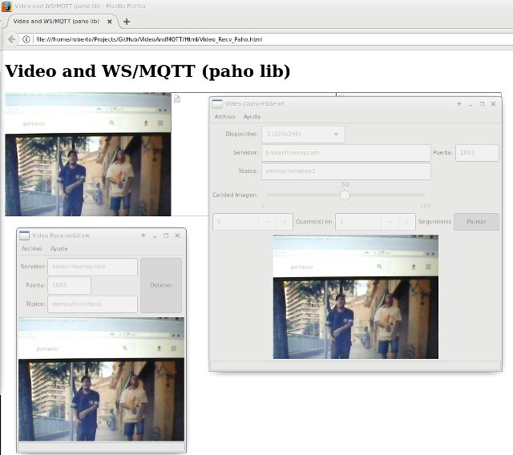

# VideoAndMQTT
Use MQTT to send and receive audio/video from python3 using OpenCV and wxPython

* Html/:
    * Video_Recv_Paho.html; html/javascript to show video frames received via websockets using the PAHO library
    * Video_Recv_ws.html; html/javascript to show video frames received via websockets running in Node-Red bridge
* NodeRed/:
  * WSocket_NodeRed.flow; flow to get video frames from an MQTT broker and send it using websockets
* Python/:
  * Video_Send.py; capture, display and send video frames using wxPyhton GUI
  * Video_Recv.py; receive and display video frames using wxPython GUI
  * Video_Send_CmdLine.py: capture and sebd video frames from command line

To DO
* Android App
* Audio modules

# Screenshots

